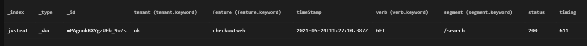

<div align="center">

# f-stat-client


Javascript HTTP client for publishing stats to ElasticSearch

</div>

---

[](https://badge.fury.io/js/%40justeat%2Ff-stat-client)
[](https://circleci.com/gh/justeat/workflows/fozzie-components)
[](https://coveralls.io/github/justeat/f-stat-client)
[](https://snyk.io/test/github/justeat/f-stat-client?targetFile=package.json)

This client abstracts away the complexity of publishing stats to ElasticSearch, such as API timings so you can then graph on these results.  It also provides a standardised approach for to follow that can be used in a suite of features and components, allowing you to use and report in a generic way.

## Benefits (Now)
- Simple publish method that hides away the complexities of making posts requests to ElasticSearch
- Sensible defaults, with the ability to override all
- If you run ElasticSearch locally in a Docker Container and use the host `localhost` then you can see you results instantly (see https://www.elastic.co/guide/en/elasticsearch/reference/7.0/docker.html & https://elasticvue.com/)
- Built-in mock ability by providing a mock on the constructor (see https://github.com/elastic/elasticsearch-js-mock and an example below)

## Benefits (Soon)
- _encapsualted batch publishing_
- _encapsualted sample publishing_
- _encapsualted authentication_
<hr></br>

## Usage
</br>

### *Installation*

Install the module using npm or Yarn:

```sh
yarn add @justeat/f-stat-client
```
### *Initialisation/Construction e.g.*
```js
import StatClient from '@justeat/f-stat-client';

const client = new StatClient('http://localhost:9200', 'uk', 'checkoutWeb');

```
### *How to use*
```js

await client.publish({ verb: 'GET', segment: '/search', status: 200, timimg: 611 });

```
Note; the dynamic model passed to the `publish()` method will get deconstructed and written out as individual fields on the ElasticSearch document along with the fixed fields of `FeatureName`, `Tenant` and a `Timestamp`.

*An example of the final document written to ElasticSearch:*


### *How to test/mock e.g.*
```js
import StatClient from '@justeat/f-stat-client';

const Mock = require('@elastic/elasticsearch-mock');

const mock = new Mock();

// Build a cut down mock reponse
const mockResponse = {
    _index: 'justeat',
    result: 'created',
    statusCode: 201
};

// Mock the action to return the mock response
mock.add({
    method: 'POST',
    path: '*'
}, () => (mockResponse));

// Supply the mock on the constructor
const client = new StatClient('http://localhost:9200', 'uk', 'checkoutWeb', '', '', null, mock);

// Act
const response = await client.publish({ verb: 'GET', segment: '/basket', status: 200, timimg: 654 });

// Assert
expect(response.body.result).toBe('created');

```
</br>
<hr></br>

## Constructor
All values are optional, you don't need to specify any overrides if you are happy with the default values

Parameter | Description | Type | Default
------------- | ------------- | ------------- | -------------
uri | The host of the stat publishing endpoint | String | '`http://localhost:9200`'
tenant | This is a key identifier to group stats by country, e.g. `uk` | String | 'ns'
featureName | This is a key identifier to group stats by feature, e.g. `salesWebsite` | String | 'Generic Front End'
user | The username to gain access to the stat publishing endpoint (if not supplied then no authentication will be used) | String | `null`
pwd | The password to gain access to the stat publishing endpoint (ignored if `user` not supplied) | String | `null`
indexName | This is index to write to | String | 'justeat'
mock | This can be supplied for testing purposes and will use/return your mock response instead | String | `null`
<hr></br>

## Client Methods
These are all of the methods exposed by the httpClient

Method | Description | Parameters | Example
------------- | ------------- | ------------- | -------------
publish | Sends a dynamic model (stat details) to the Endpoint | `json` _[string]_ | `{`</br>`verb: 'GET',`</br>`segment: '/search',`</br>`status: 200,`</br>`timing: 654`</br>`}`
